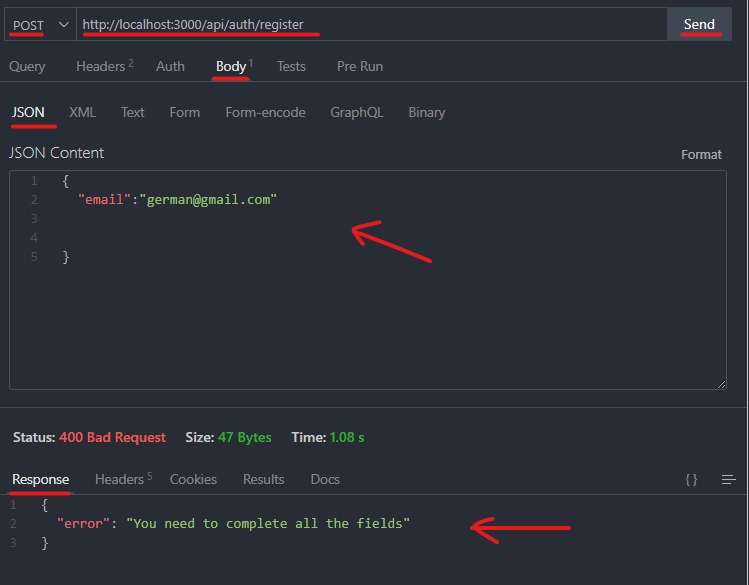
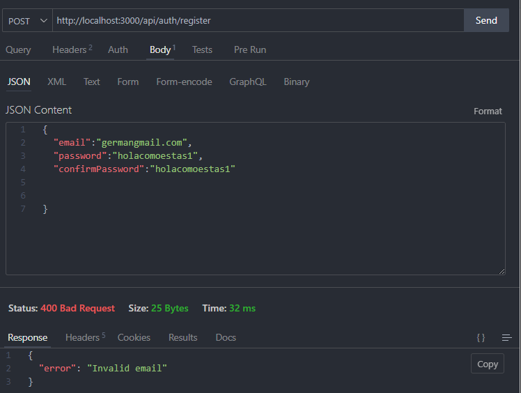
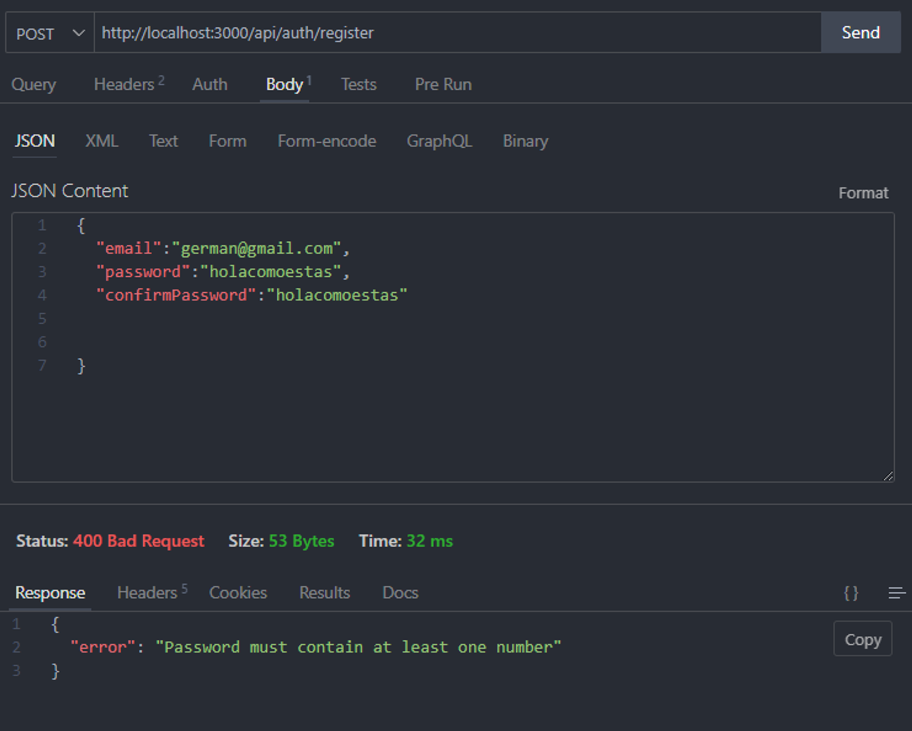
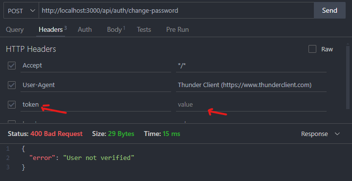

# Autentificación React

A continuación voy a dar los pasos que seguí para construir esta app de autentificación con **Next.js**, en donde podrás crear tu cuenta, confirmarla, logearte, cambiar contraseña y enviar emails al usuario con la api de resend [resend.com](http://resend.com/). Y guardar los datos del usuario en una base de datos no relacional **MongoDB**

## Instalación

Para este proyecto utilizare Next.js.

***Get Started Next.js***

```bash
npx create-next-app@latest
```

Instalar dependencias necesarias para el proyecto.

- **bcryptjs**: Una biblioteca para realizar hashing de contraseñas en JavaScript, utilizada para asegurar la información de los usuarios.
- **cookie**: Una biblioteca para manejar cookies HTTP en Node.js, facilitando la creación, lectura y manipulación de cookies en aplicaciones web.
- **mongoose**: Una biblioteca para modelar datos en MongoDB utilizando esquemas de JavaScript, ofreciendo una capa de abstracción para trabajar con bases de datos no relacionales.
- **resend**: Una biblioteca o servicio para reintentar el envío de correos electrónicos fallidos, garantizando la entrega de mensajes importantes.
- **sass**: Un preprocesador de CSS que permite utilizar variables, anidación y otras características avanzadas para escribir hojas de estilo más mantenibles y eficientes.
- **jsonwebtoken**: Una biblioteca para crear y verificar JSON Web Tokens (JWT), utilizada en la autenticación y autorización de usuarios en aplicaciones web.

```bash
npm install bcryptjs cookie mongoose resend sass jsonwebtoken
```

Dependencias de desarrollo

```bash
npm i -D @types/bcryptjs @types/cookie @types/jsonwebtoken
```

## Backend

## Directorio

```
src
├── app
│   ├── api
│   │   ├── auth
│   │   │   ├── change-password
│   │   │   │   └── route.ts
│   │   │   ├── check
│   │   │   │   └── route.ts
|   |   |   ├── confirm-account
│   │   │   │   └── route.ts
│   │   │   ├── forgot-password
│   │   │   │   └── route.ts
│   │   │   ├── login
│   │   │   │   └── route.ts
│   │   │   ├── resend-otp
│   │   │   │   └── route.ts
│   │   │   ├── signup
│   │   │       └── route.ts
│   │   ├── users
│   │   │   └── route.ts
│   │   └── ...
│   ├
│   │   
│   ├── globals.css
│   ├── page.tsx
│   └── ...
├── libs
│   ├── mongodb.ts
│   └── ...
├── models
│   ├── User.ts
│   ├── TempUser.ts
│   └── ...
├── utils
│   ├── isValidEmail.ts
│   ├── messages.ts
│   └── ...
├── middleware.ts
└── 
```

Dentro de auth van los endpoints de la app. 

## Crear endpoints

Los endpoints a crear son:

- change-password: cambiar contraseña
- check: validar que el usuario este autentificado, y refrescar token
- confirm-account: confirmar cuenta desde un email
- forgot-password: Por si te olvidas la contraseña, te manda un email
- login: Logearse / sign-in
- resend-otp: reenviar código otp no más de 3 veces.
- signup: Crear cuenta.

Recuerda crear estas carpetas con su route.js dentro de auth.

## Conectar a mongo y crear modelo de usuario

### Conectar a Mongo

Vamos a crear una carpeta dentro de `src` llamada `libs` para crear la conexión a mongo.

***src/libs/mongodb.ts***

```tsx
import mongoose from "mongoose";
                                       //nombre de carpeta raiz
const MONGO_URI = "mongodb://127.0.0.1/auth-next-13";

export const connectDB = async () => {
    try{
        await mongoose.connect(MONGO_URI);
        console.log("MongoDB connected");
    }catch(error){
        console.log(error);
    }
};
```

### Modelo de usuario

### User.ts

Vamos a crear una carpeta dentro de `src` llamada `models` para crear nuestro modelo de usuario con sus atributos.

***src/models/User.ts***

```tsx
import mongoose, { Schema, Document, ObjectId } from "mongoose";

export interface IUser {
  _id?: ObjectId | string | undefined;
  email: string;
  password: string;
  isConfirmed: boolean;
  created_at?: string;
  updated_at?: string;
}

export interface IUserSchema extends Document {
  _id?: ObjectId | string | undefined;
  email: string;
  password: string;
  isConfirmed: boolean;
  created_at?: string;
  updated_at?: string;
}

const UserSchema: Schema = new Schema(
  {
    email: { type: String, required: true, unique: true },
    password: { type: String, required: true },
    isConfirmed: { type: Boolean, default: false },
  },
  {
    versionKey: false,
    timestamps: true,
  }
);

const User = mongoose.models.User || mongoose.model("User", UserSchema);

export default User;

```

- **mongoose**: Biblioteca de Node.js para modelar datos en MongoDB.
- **Schema**: Clase de Mongoose que se utiliza para definir la estructura de los documentos en una colección.
- **Document**: Interfaz de TypeScript que representa un documento de Mongoose.
- **ObjectId**: Tipo de dato que representa el identificador único de un documento en MongoDB.
- **Interfaz `IUser`**: Define la estructura de un objeto de usuario en TypeScript.
- **Interfaz `IUserSchema`**: Extiende `Document` y define la estructura de un documento de usuario en Mongoose.
- **`UserSchema`**: Define la estructura de los documentos de usuario en MongoDB.
- **`User`**: Modelo de Mongoose para la colección de usuarios.
- **Exportación**: El modelo se exporta para ser utilizado en otras partes de la aplicación, permitiendo crear, leer, actualizar y eliminar usuarios en la base de datos MongoDB.

### TempUser

La solución que se me ocurrió, no se si es valida o no, pero al crear una cuenta en /signup creamos un usuario temporal en la colección `tempUsers`, esto es para esperar que el usuario confirme la cuenta, si no la confirma dentro de 30min el usuario es borrado de la colección. Ahora si confirma la cuenta desde el email con el código otp, el usuario es borrado de la colección `tempUsers` y seteado/creado en la colección `users` para siempre.

***src/models/TempUsers.ts***

```tsx
import mongoose, { Schema, Document, Model } from 'mongoose';

export interface ITempUser {
  email: string;
  password: string;
  otp: string;
  otpAttempts: number;
  expireAt: Date;
  createdAt?: Date;
}

export interface ITempUserDocument extends ITempUser, Document {}

export interface ITempUserModel extends Model<ITempUserDocument> {}

const TempUserSchema: Schema = new Schema({
  email: { type: String, required: true, unique: true },
  password: { type: String, required: true },
  otp: { type: String, required: true },
  otpAttempts: { type: Number, default: 0 },
  expireAt: { type: Date, required: true},
  createdAt: { type: Date, default: Date.now,}
},{
  versionKey: false,
  timestamps: true,
});

TempUserSchema.index({ expireAt: 1 }, { expireAfterSeconds: 0 });

const TempUser = mongoose.models.TempUser as ITempUserModel || mongoose.model<ITempUserDocument, ITempUserModel>('TempUser', TempUserSchema);

export default TempUser;
```

## Carpeta Utils

Como viste en el directorio dentro de la carpeta utils tenemos dos archivos.

- isValidEmail.ts
- messages.ts

### isValidEmail.ts

Exportamos una función para usarla al momento de validar que un email sea correcto. 

***src/utils/isValidEmail.ts***

```tsx
export function isValidEmail(email: string): boolean {
const emailRegex = /^[^\s@]+@[^\s@]+\.[^\s@]+$/;
return emailRegex.test(email);

}
```

### messages.ts

Objeto donde guardamos todos los mensajes tanto de errores como de éxitos. Los usaremos posteriormente en todos los endpoints.

***src/utils/messages.ts***

```tsx
export const messages ={
    success: {
        userRegistered: "User registered successfully",
        userLogged: "User logged successfully",
        emailSent: "Email sent successfully",
        passwordChanged: "Password changed successfully",
        userVerified: "User verified successfully",
        accountConfirmed: "Account confirmed successfully",
        
    }
    ,
    error:{
        needProps: "You need to complete all the fields",
        invalidEmail: "Invalid email",
        passwordsDontMatch: "Passwords don't match",
        passwordSmall: "Password must be at least 8 characters",
        passwordNoNumber: "Password must contain at least one number",
        userEmailExists: "An User with this email already exists",
        generic: "Something went wrong",
        userNotFound: "User not found",
        invalidPassword: "Invalid password",
        invalidToken: "Invalid token",
        userNotVerified: "User not verified",
        notConfirmedAccount: "Account not confirmed",
        newPasswordSameAsOldPassword: "New password can't be the same as old password",
        notSendEmail: "A error ocurred while sending email",
        userAlreadyVerified: "User already verified",
        invalidOtp: "Invalid Code OTP",
        tooManyAttempts: "Too many attempts. Please try signing up again.",
        
    }
}
```

## Tokens

Primero una introducción a qué son los token.

Los tokens JWT (JSON Web Tokens) son una forma segura de transmitir información entre partes en forma de un objeto JSON compacto. Se utilizan comúnmente para autenticación y autorización.

**Analogía con la vida cotidiana:**
Imagina que vas a un parque de diversiones y te dan una pulsera especial que tiene un código QR. Esta pulsera representa tu "token JWT". La pulsera contiene información sobre ti, como tu nombre y el tipo de pase que tienes (por ejemplo, pase de un día). Cuando quieres subir a una atracción, simplemente muestras la pulsera. Los empleados escanean el código QR para verificar que tienes permiso para subir a esa atracción. No necesitan pedirte información adicional porque toda la información necesaria está en la pulsera.

De manera similar, un JWT contiene información (como el ID del usuario y sus permisos) y se envía con cada solicitud al servidor, eliminando la necesidad de repetir la autenticación en cada solicitud.

### access token

Ahora bien en este proyecto voy a usar tres tipos de access_token.

Recordemos que se suelen llamar access_token porque justamente te permiten acceder a algo.

Nosotros vamos a usar:

- *Token de Sesión:*
    - Utilizado para autenticar al usuario en las solicitudes después de iniciar sesión.
    - Y va a estar guardado en una cookie.
    - Posiblemente lo declaramos como `sessionToken`
    - Tendra una duracion de 6 horas
- *Token de confirmacion de cuenta:*
    - Utilizado para que el usuario confirme su cuenta.
        - Pensemos primero porque enviamos un email para confirmar su cuenta? Yo lo veo útil por si alguna persona quiere crear una cuenta con tu email. Tenés la opción de confirmar que fuiste vos realmente el que está intentando hacerlo. Seria un metodo mas de seguridad.
    - Lo declararemos como `confirmationToken`
    - Tendrá una duración de 30min
        - Si realmente posees ese email, lo confirmarías en menos tiempo.
        - Te doy unos ejemplos:
            - En twitter el codigo de confirmacion expira en 2hs
            - En Gate.io el codigo de verificacion expira en 10min
            - En Twitch el codigo de verificacion expira en 4hs
- *Token de Cambio de Contraseña*
    - Utilizado para cuando el usuario quiera cambiar su contraseña
    - Lo declararemos como `resetPasswordToken`
    - Tendrá una duración de 4hs

### Refresh Token

Ten en cuenta que el access token denominado `sessionToken` expirará transcurridas 6 horas desde que se solicitó. Por eso, para asegurar que puedas trabajar por un tiempo prolongado y no sea necesario solicitar constantemente al usuario que se vuelva a loguear para generar un token nuevo, le brindamos la solución de trabajar con un refresh token. Además, recuerda que el refresh_token es de uso **único y recibirás uno nuevo en cada proceso de actualización del token**.
Lo llamaremos `refreshToken`  y durará 15 días.

## Rutas - POST

### Signup

Pensemos primeramente cómo se vería nuestro form de register/sign-up y que datos vamos a pedir y guardar.

Para este proyecto usaremos

- email
- password
- confirmPassword

Constará de esos tres campos que serán enviados desde el front.

Pensemos que el usuario no se creará hasta que el cliente no se confirme su cuenta desde el email.

Una vez recibidos en el back debemos seguir estos pasos.

1. Destructurar el json enviado con los datos.
2. Realizar las validaciones.
3. Hashear la contraseña
4. Crear código OTP
5. Crear el usuario temporal TempUser
6. Crear el `confirmationToken` en el guardamos el id del tempUser
7. Enviar Email para confirmar cuenta
8. Devolver la respuesta con ese usuario

- Validaciones
    - Validar que los campos no esten vacios.
    - Validar que el email sea válido, conste con @,etc.
    - Validar que las contraseñas coincidan.
    - Validar que la contraseña tenga al menos 8 caracteres.
    - Validar que la contraseña tenga al menos un número.
    - Validar que no exista un usuario con ese email.
    - Validar que no exista un usuario temporal con ese email.

***src/app/api/auth/signup/route.ts***

```tsx
import { NextRequest, NextResponse, userAgent } from "next/server";
import { isValidEmail } from "@/utils/isValidEmail";
import User, { IUser, IUserSchema } from "@/models/User";
import TempUser, { ITempUser } from "@/models/TempUsers";
import { Types } from "mongoose";
import { messages } from "@/utils/messages";
import { connectDB } from "@/libs/mongodb";
import jwt from "jsonwebtoken";
import bcrypt from "bcryptjs";
import { Resend } from "resend";
import { EmailTemplate } from "@/components/EmailTemplate/email-template";
import React from "react";

const resend = new Resend(process.env.RESEND_API_KEY as string);

//el nombre de la funcion debe ser como el metodo de las peticiones
export async function POST(request: NextRequest) {
  try {
    await connectDB();

    const body = await request.json();

    // desestructuramos el body
    const { email, password, confirmPassword } = body;

    //-------------- VALIDACIONES -------------
    //validamos que los campos no esten vacios
    if (!email || !password || !confirmPassword) {
      return NextResponse.json(
        { error: messages.error.needProps },
        { status: 400 }
      );
    }

    //validar que el email sea valido
    if (!isValidEmail(email)) {
      return NextResponse.json(
        { error: messages.error.invalidEmail },
        { status: 400 }
      );
    }

    //validar que las contrasenias coincidan
    if (password !== confirmPassword) {
      return NextResponse.json(
        { error: messages.error.passwordsDontMatch },
        { status: 400 }
      );
    }

    //validar que la contrasenia tenga al menos 8 caracteres
    if (password.length < 8) {
      return NextResponse.json(
        { error: messages.error.passwordSmall },
        { status: 400 }
      );
    }

    //validar que la contrasenia tenga al menos un numero
    if (!password.match(/\d/)) {
      return NextResponse.json(
        { error: messages.error.passwordNoNumber },
        { status: 400 }
      );
    }

    //validar que no exista un usuario con ese email
    const userFind = await User.findOne({ email });

    if (userFind) {
      return NextResponse.json(
        { error: messages.error.userEmailExists },
        { status: 400 }
      );
    }

    //validar que no exista un usuario temporal con ese email
    const tempUserFind = await TempUser.findOne({ email });
    
    //si existe lo elimino
    if (tempUserFind) {
      await TempUser.findByIdAndDelete(tempUserFind)
    }

    // hash de la contrasenia
    const hashedPassword = await bcrypt.hash(password, 10);

    //creo un codigo OTP de 6 digitos
    const otp = Math.floor(100000 + Math.random() * 900000).toString();

    // Genera un nuevo ObjectId
    const tempId = new Types.ObjectId();

    // expira luego de 30min
    const thirtyMinutesFromNow = new Date(Date.now() + 30 * 60 * 1000);

    // Crea el usuario temporal
    const newTempUser = new TempUser({
      email,
      password: hashedPassword,
      otp: otp,
      otpAttempts: 0,
      expireAt: thirtyMinutesFromNow,
    });

    // Asigna el _id 
    newTempUser._id = tempId;

    // Guarda el usuario temporal
    await newTempUser.save();

    //Creamos token de confirmacion de cuenta. Expira en 30 minutos
    const confirmationToken = jwt.sign(
      {
        data: {
          tempId: tempId.toString(),
        },
      },
      process.env.JWT_SECRET as string,
      {
        expiresIn: "30m",
      }
    );

    const { os, device } = userAgent(request);
    const deviceInfo = `${device.type || "Unknown"} on ${os.name || "Unknown"}`;

    //enviamos el email de confirmacion de cuenta a su email
    const confirmUrl: string = `http://localhost:3000/confirm-account?token=${confirmationToken}`;
    const title = "Register email verification";
    const description = `Hello ${email}. An email verification code request is detected by us`;
    const descriptionLink = "Confirm account";

    const { data, error } = await resend.emails.send({
      from: "onboarding@resend.dev",
      to: [email],
      subject: "Confirm your account",
      react: EmailTemplate({
        buttonUrl: confirmUrl,
        title,
        description,
        descriptionLink,
        otpCode: otp,
        ip: "Unknown",
        location: "Unknown",
        device: deviceInfo,
      }) as React.ReactElement,
    });

    //si hay un error en el envio del email
    if (error) {
      return NextResponse.json({ error: error }, { status: 500 });
    }

    //Si todo esta bien devolvemos la respuesta
    const response = NextResponse.json(
      {
        isAuthorized: false,
        message: messages.success.emailSent,
      },
      {
        status: 200,
      }
    );

    return response;
  } catch (error) {
    return NextResponse.json(
      { error: messages.error.generic },
      { status: 500 }
    );
  }
}

```

Si tienen postman recomiendo utilizarlo para comprobar el funcionamiento. Yo tengo una extencion en vsc llamada Thunder Client.

**Escenario N°1**

Solo completa un solo campo, en este caso email:



Primero recordemos setear en POST, colocar la url, Body en formato json.

Como vemos en la foto, yo mando un json con solo el email, y me devuelve un mensaje de error, diciendo que complete todos los campos, como lo habíamos previamente programado.

**Escenario N°2**

Email invalidó no contiene @.



**Escenario N°3**

Contraseña menor a 8 digitos.


**Escenario N°4**

Contraseña mayor a 8 dígitos pero sin un número.



**Escenario N°5**

Contraseña mayor a 8 dígitos, con un número, pero diferente al `confirmPassword`.


**Escenario N°6**

Un usuario ya existe con ese email.


### Confirm-Account

Pensemos primeramente cómo se vería nuestro form de confirm-account y que datos vamos a pedir y guardar.

En nuestro front enviaremos el código OTP de verificación.

Y si es válido crearemos la cuenta.

El id de la cuenta viajan en `confirmationToken` 

Pensemos que el usuario no se creará hasta que el cliente no se confirme su cuenta desde el email y escriba el código.

Una vez recibidos en el back debemos seguir estos pasos.

1. Obtener body desde el front, que es el código que seteo el usuario
2. Obtener `confirmationToken` de la cabecera HTTP
3. Validar que exista el `confirmationToken`
4. Obtengo la data del token osea el id del usuario.
5. Busco el usuario en la colección tempUser con ese id
6. Valido que el código otp guardado en el documento del tempUser sea el mismo con el mandado por front.
7. Creo el usuario y lo guardo en la colección users
8. Devolver respuesta exitosa.

***src/app/api/auth/confirm-account/route.ts***

```tsx
import { connectDB } from "@/libs/mongodb";
import User, { IUser, IUserSchema } from "@/models/User";
import TempUser, { ITempUser} from "@/models/TempUsers";
import { headers } from "next/headers";
import { NextRequest, NextResponse } from "next/server";
import jwt from "jsonwebtoken";
import { messages } from "@/utils/messages";

interface BodyProps {
  otpCode: string;
}

export async function POST(request: NextRequest) {
  try {
    await connectDB();

    //obtenemos el body del front que es el codigo otp
    const body: BodyProps = await request.json();

    //1- destructuramos el body con el codigo otp que manda el usuario
    const { otpCode } = body;

    //2- Obtener el token de la cabecera de la solicitud HTTP
    const headersList = headers();
    const confirmationToken = headersList.get("token");
    
    //si no existe token no puedo confirmar la cuenta
    if (!confirmationToken) {
      return NextResponse.json(
        { error: messages.error.userNotVerified },
        { status: 400 }
      );
    }

    try {
      //obtengo la info del token 
      const { data: confirmationTokenData } = jwt.verify(
        confirmationToken,
        process.env.JWT_SECRET as string
      ) as any;

      const {tempId} = confirmationTokenData;

      //buscar el usuario temporal
      const tempUser = await TempUser.findById(tempId);

      if(!tempUser){
        return NextResponse.json(
          { error: messages.error.userNotFound },
          { status: 400 }
        );
      }

      //validamos que el otp sea el correcto
      if (tempUser.otp !== otpCode) {
        return NextResponse.json(
          { error: messages.error.invalidOtp },
          { status: 400 }
        );
      }

      // creo el usuario
      const newUser: IUserSchema = new User({
        email: tempUser.email,
        password: tempUser.password,
        isConfirmed: true,
      });

      //@ts-ignore
      const { password: userPass, ...rest } = newUser._doc;

      //guardamos el usuario
      await newUser.save();

      //eliminamos el usuario temporal
      await TempUser.findByIdAndDelete(tempUser);

      //devolvemos la respuesta
      const response = NextResponse.json(
        {
          user: '',
          message: messages.success.userRegistered,
        },
        {
          status: 200,
        }
      );

      return response;
    } catch (error) {
      return NextResponse.json(
        { error: messages.error.invalidToken },
        { status: 500 }
      );
    }
  } catch (error) {
    return NextResponse.json(
      { error: messages.error.generic },
      { status: 500 }
    );
  }
}

```

Ahora si entramos en nuestro MongoDB Compass podremos ver al usuario cargado dentro de la colección **users** y db **auth-next-13**


### Resend-otp

El código otp se reenvía desde /signup. Una vez que se se completa el formulario de /signup correctamente, se abre un nuevo layout en el que se muestra un mensaje sobre que se envió al email, la verificación de correo con su código. A su vez hay dos botones uno para reenviar el código y otro para ir a /login.

Está programado para que solo se envie 3 veces nomas. 

Entonces en nuestra lógica del backend vamos a recibir ése email para verificar el usuario y actualizar el código otp. Recordemos que el modelo de tempUser tenía un atributo ‘otp’.

Entonces lo que haremos será:

- Recibir email desde el front - body
- Buscar el usuario en TempUser
- Condicional para solo permitir 3 reenvios de código
- Generar nuevo código OTP
- Actualizar el atributo otp del tempUser con el nuevo
- Crear nuevo `confirmationToken`
- Enviar Email para confirmar cuenta
- Devolver la respuesta con ese usuario

***src/app/api/auth/resend-otp/route.ts***

```tsx
import { EmailTemplate } from "@/components/EmailTemplate/email-template";
import { connectDB } from "@/libs/mongodb";
import TempUser from "@/models/TempUsers";
import { messages } from "@/utils/messages";
import { NextRequest, NextResponse, userAgent } from "next/server";
import jwt from "jsonwebtoken";
import { Resend } from "resend";
const resend = new Resend(process.env.RESEND_API_KEY as string);

export async function POST(request: NextRequest) {
  try {
    await connectDB();

    const { email } = await request.json();

    //Buscar usuario
    const tempuser = await TempUser.findOne({ email });

    if (!tempuser) {
      return NextResponse.json(
        { error: messages.error.userNotFound },
        { status: 404 }
      );
    }
    //solo dejamos reenviar OTP 3 veces
    if (tempuser.otpAttempts >= 3) {
      return NextResponse.json(
        { error: messages.error.tooManyAttempts },
        { status: 400 }
      );
    }

    //Generar OTP
    const newOtp = Math.floor(100000 + Math.random() * 900000).toString();

    //Actualizar datos
    tempuser.otp = newOtp;
    tempuser.otpAttempts += 1;
    await tempuser.save();

    //Creamos token de confirmacion de cuenta. Expira en 30 minutos
    const confirmationToken = jwt.sign(
        {
          data: {
           tempId: tempuser._id,
          },
        },
        process.env.JWT_SECRET as string,
        {
          expiresIn: "30m",
        }
      );

    const { os,device } = userAgent(request)
    const deviceInfo = `${device.type || "Unknown"} on ${os.name || "Unknown"}`;

    //enviamos el email de confirmacion de cuenta a su email
    const confirmUrl: string = `http://localhost:3000/confirm-account?token=${confirmationToken}`;
    const title = "Register email verification";
    const description = `Hello ${email}. An email verification code request is detected by us.`;
    const descriptionLink = "Confirm account";

    const { data, error } = await resend.emails.send({
      from: "onboarding@resend.dev",
      to: [email],
      subject: "Confirm your account",
      react: EmailTemplate({
        buttonUrl: confirmUrl,
        title,
        description,
        descriptionLink,
        otpCode: newOtp,
        ip: "Unknown",
        location: "Unknown",
        device: deviceInfo,
      }) as React.ReactElement,
    });

    //si hay un error en el envio del email
    if (error) {
      return NextResponse.json({ error: error }, { status: 500 });
    }

    //enviamos la response
    const response = NextResponse.json(
      {
        isAuthorized: false,
        message: messages.success.emailSent,
      },
      {
        status: 200,
      }
    );

    return response;
  } catch (error) {
    return NextResponse.json(
      { error: messages.error.generic },
      { status: 500 }
    );
  }
}

```

### Login

Pensemos primeramente cómo se vería nuestro form de login/sign-in y que datos vamos a pedir y guardar.

Para este proyecto usaremos

- email
- password

Constará de esos dos campos que serán enviados desde el front.

Una vez recibidos en el back debemos seguir estos  pasos.

1. Destructurar el body enviado
2. Realizar las validaciones.
3.  **Obtener los datos del usuario
4. Crear el `sessionToken` y `refreshToken`
5. Devolver la respuesta con ese usuario
6. Setear las cookies `sessionToken_cookie` y `refreshToken_cookie`

- Validaciones
    - Validar que los campos no esten vacios.
    - Validar que el email sea válido, conste con @,etc.
    - Validar que exista el usuario
    - Validar que el usuario esté confirmado
    - Validar que la contraseña sea correcta

***src/app/api/auth/login/route.ts***

```tsx
import { connectDB } from "@/libs/mongodb";
import User, { IUser } from "@/models/User";
import { isValidEmail } from "@/utils/isValidEmail";
import { messages } from "@/utils/messages";
import { NextRequest, NextResponse } from "next/server";
import jwt from "jsonwebtoken";
import bcrypt from "bcryptjs";

// API route for user login
//el nombre de la funcion debe ser como el metodo de las peticiones
export async function POST(request: NextRequest) {
  try {
    await connectDB();
    const body: IUser = await request.json();

    //1- desestructuramos el body
    const { email, password } = body;

    //2 -------------- VALIDACIONES -------------
    //validamos que los campos no esten vacios
    if (!email || !password) {
      return NextResponse.json(
        { error: messages.error.needProps },
        { status: 400 }
      );
    }

    //validar que el email sea valido
    if (!isValidEmail(email)) {
      return NextResponse.json(
        { error: messages.error.invalidEmail },
        { status: 400 }
      );
    }

    //Buscar al usuario en la base de datos poe email
    const userFind = await User.findOne({ email });

    //validar que exista el usuario
    if (!userFind) {
      return NextResponse.json(
        { error: messages.error.userNotFound },
        { status: 400 }
      );
    }

    //validar que el usuario este confirmado
    if (!userFind.isConfirmed) {
      return NextResponse.json(
        { error: messages.error.notConfirmedAccount },
        { status: 400 }
      );
    }

    //validar que las contrasenia sea la correcta
    const isCorrect: boolean = await bcrypt.compare(
      password,
      userFind.password
    );

    if (!isCorrect) {
      return NextResponse.json(
        { error: messages.error.invalidPassword },
        { status: 400 }
      );
    }

    //3- Obtener los datos de ese Usuario
    // Desestructuramos el objeto userFind._doc, excepto la propiedad password, y lo asignamos a la variable rest.
    // userFind._doc es un objeto que contiene todas las propiedades del usuario, excepto la contraseña, que está en una variable separada llamada password.
    // La sintaxis {password: userPass, ...rest} indica que queremos mantener la propiedad password como una variable separada, y que queremos asignar todas las demás propiedades al objeto rest.
    const { password: userPass, ...rest } = userFind._doc;

    /*4- crear el token con el cual el usuario inicia sesion y se mantiene logeado en un futuro
        crearemos un refreshToken para que el usuario pueda renovar su sesion
    */
    const sessionToken = jwt.sign(
      { data: rest },
      process.env.JWT_SECRET as string,
      {
        expiresIn: "6h",
      }
    );

    // 5 - Crear el Refresh Token
    const refreshToken = jwt.sign(
      { data: rest },
      process.env.JWT_REFRESH_SECRET as string,
      {
        expiresIn: "15d",
      }
    );

    //- devolvemos la respuesta
    const response = NextResponse.json(
      {
        message: messages.success.userLogged,
      },
      {
        status: 200,
      }
    );

    //- seteamos el cookie con el sessionToken
    response.cookies.set("sessionToken_cookie", sessionToken, {
      httpOnly: true,
      maxAge: 6 * 60 * 60, // 6 horas
      sameSite: "strict",
      secure: process.env.NODE_ENV === "production",
      path: "/",
    });

    //- seteamos el cookie con el refreshToken
    response.cookies.set("refreshToken_cookie", refreshToken, {
      httpOnly: true,
      maxAge: 15 * 24 * 60 * 60, // 15 dias
      sameSite: "strict",
      secure: process.env.NODE_ENV === "production",
      path: "/",
    });

    

    return response;
  } catch (error) {
    return NextResponse.json(
      { error: messages.error.generic },
      { status: 500 }
    );
  }
}

```

Si tienen postman recomiendo utilizarlo para comprobar el funcionamiento. Yo tengo una extencion en vsc llamada Thunder Client.

Los escenarios de validar que los campos no esten vacios y que el email sea válido no los hare porque son iguales que los anteriores.

**Escenario N°1**

Validar que el usuario exista - Email Incorrecto / No encontrado


**Escenario N°2**

Validar que la contraseña sea correcta - Email Correcto / Contraseña Incorrecta


**Escenario N°3**

Todo Ok - Email Correcto / Contraseña Correcta


### Forgot-Password

Pensemos primeramente cómo se vería nuestro form de forgot-password y que datos vamos a pedir y guardar.

Para este proyecto usaremos

- email

Constará de ese único campo que será enviado desde el front.

Una vez recibidos en el back debemos seguir estos pasos.

1. Destructurar el json enviado
2. Realizar las validaciones
3. Crear el `resetPasswordToken` 
4. Generar url de cambio de contraseña
5. Enviar el email al usuario *con la URL de cambio de contraseña*
6. Devolver respuesta

- Validaciones
    - Validar que los campos no esten vacios.
    - Validar que el email sea válido, conste con @,etc.
    - Validar que exista el usuario con ese email
    - Validar que el usuario esté verificado
    

***src/app/api/auth/forget-password/route.ts***

```tsx
import { connectDB } from "@/libs/mongodb";
import User, { IUser } from "@/models/User";
import { NextRequest, NextResponse } from "next/server";
import { Resend } from "resend";
import jwt from "jsonwebtoken";
import { messages } from "@/utils/messages";
import { isValidEmail } from "@/utils/isValidEmail";
import { EmailTemplate } from "@/components/EmailTemplate/email-template";

interface BodyProps {
  email: string;
}

const resend = new Resend(process.env.RESEND_API_KEY as string);

export async function POST(request: NextRequest) {
  try {
    await connectDB();
    //obtenemos el body del front
    const body: BodyProps = await request.json();

    //1- destructuramos el body
    const { email } = body;

    //2 -------------- VALIDACIONES -------------
    //validamos que los campos no esten vacios
    if (!email) {
      return NextResponse.json(
        { error: messages.error.needProps },
        { status: 400 }
      );
    }

    //validar que el email sea valido
    if (!isValidEmail(email)) {
      return NextResponse.json(
        { error: messages.error.invalidEmail },
        { status: 400 }
      );
    }

    //Buscar el usuario en la base de datos poe email y validar que exista
    const userFind = await User.findOne({ email });
    if (!userFind) {
      return NextResponse.json(
        { error: messages.error.userNotFound },
        { status: 404 }
      );
    }

    //validar que el usuario este verificado
    if (!userFind.isConfirmed) {
      return NextResponse.json(
        { error: messages.error.notConfirmedAccount },
        { status: 400 }
      );
    }

    // 3- creamos un objeto con el email y el id del usuario encontrado
    const resetPasswordTokenData = {
      email: userFind.email,
      _id: userFind._id,
    };

    // 3- generamos un token con el objeto de datos del usuario
    // el token sera firmado con la clave secreta definida en el archivo .env
    // y expirara en un dia
    const resetPasswordToken = jwt.sign(
      { data: resetPasswordTokenData },
      process.env.JWT_SECRET as string,
      {
        expiresIn: "4h",
      }
    );

    // 4- generamos la URL de cambio de contraseña concatenando la URL de la app
    // con el token generado previamente y los datos del componente
    const forgetUrl: string = `http://localhost:3000/change-password?access_token=${resetPasswordToken}`;
    const title = "Reset your password";
    const description =
      "Follow the button to reset the password for your user.";
    const descriptionLink = "Reset password";

    // 5- enviamos el email al usuario con la URL de cambio de contraseña
    const { data, error } = await resend.emails.send({
      from: "onboarding@resend.dev",
      to: [email],
      subject: "Change your password",
      react: EmailTemplate({
        buttonUrl: forgetUrl,
        title,
        description,
        descriptionLink,
      }) as React.ReactElement
    });

    if (error) {
      return NextResponse.json(
        { error: messages.error.generic },
        { status: 500 }
      );
    }

    //6- Devolvemos respusta exitosa
    return NextResponse.json(
      { message: messages.success.emailSent },
      { status: 200 }
    );
  } catch (error) {
    return NextResponse.json(
      { error: messages.error.generic },
      { status: 500 }
    );
  }
}

```

Si tienen postman recomiendo utilizarlo para comprobar el funcionamiento. Yo tengo una extencion en vsc llamada Thunder Client.

Los escenarios de validar que los campos no esten vacios, que el email sea válido y que el usuario exista no los hare porque son iguales que los anteriores.

**Escenario N°1**

Todo Ok- Email Correcto → Enviar email con info sobre recuperar la contraseña.


Ahora yo en modo de ejemplo puse que el email sea enviado a mi. Esto fue lo que me llegó:


### Change Password

Pensemos primeramente cómo se vería nuestro form de change-password y que datos vamos a pedir y guardar.

Para este proyecto usaremos

- newPassword
- confirmPassword

Constará de esos dos campos que serán enviados desde el front.

Una vez recibidos en el back debemos seguir estos pasos.

1. Destructurar el json enviado - body
2. Obtener `resetPasswordToken`
3. Verificar que exista el `resetPasswordToken`
4. Verificar que el `resetPasswordToken` sea válido
5. Buscar usuario en db por id.(id guardado en `resetPasswordToken`)
6. Validar que el usuario exista
7. Validaciones
8. Encriptar la contraseña
9. Actualizar contraseña en db
10. Guardar usuario
11. Devolver Response

- Validaciones
    - Validar que los campos no esten vacios.
    - Validar que la contraseña tenga más de 8 dígitos
    - Validar que la contraseña tenga al menos un numero
    - Validar que las contraseñas coincidan(newPassword = confirmPassword)
    - Validar que la nueva contraseña sea distinta a la vieja la cual está cambiando.
    

***src/app/api/auth/change-password/route.ts***

```tsx
import { connectDB } from "@/libs/mongodb";
import { messages } from "@/utils/messages";
import { headers } from "next/headers";
import { NextRequest, NextResponse } from "next/server";
import jwt from "jsonwebtoken";
import User from "@/models/User";
import bcrypt from "bcryptjs";

interface BodyProps {
  newPassword: string;
  confirmNewPassword: string;
}

export async function POST(request: NextRequest) {
  try {
    await connectDB();

    //obtenemos el body del front
    const body: BodyProps = await request.json();

    //1- destructuramos el body
    const { newPassword, confirmNewPassword } = body;

    // 2- Obtener el token de la cabecera de la solicitud HTTP
    // headers() devuelve un objeto con todas las cabeceras de la solicitud
    // get() busca una cabecera y devuelve su valor
    // En este caso, estamos buscando la cabecera 'token'
    const headersList = headers();
    const resetPasswordToken = headersList.get("token");

    //3 - verificar que haya token
    if (!resetPasswordToken) {
      return NextResponse.json(
        { error: messages.error.userNotVerified },
        { status: 400 }
      );
    }

    try {
      //4- verificar que el token sea valido
      const isTokenValid = jwt.verify(
        resetPasswordToken,
        process.env.JWT_SECRET as string
      );

      // @ts-ignore
      const { data } = isTokenValid;

      // 5- buscar el usuario en la base de datos por id. id guardado en el token
      const userFind = await User.findById(data._id);

      //6- validar que el usuario exista
      if (!userFind) {
        return NextResponse.json(
          { error: messages.error.userNotFound },
          { status: 404 }
        );
      }

      //7-------------- VALIDACIONES -------------
      //validamos que los campos no esten vacios
      if (!newPassword || !confirmNewPassword) {
        return NextResponse.json(
          { error: confirmNewPassword },
          { status: 400 }
        );
      }

      //validar que la contrasenia tenga al menos 8 caracteres
      if (newPassword.length < 8) {
        return NextResponse.json(
          { error: messages.error.passwordSmall },
          { status: 400 }
        );
      }

      //validar que la contrasenia tenga al menos un numero
      if (!newPassword.match(/\d/)) {
        return NextResponse.json(
          { error: messages.error.passwordNoNumber },
          { status: 400 }
        );
      }
      //validar que las contrasenias coincidan
      if (newPassword !== confirmNewPassword) {
        return NextResponse.json(
          { error: messages.error.passwordsDontMatch },
          { status: 400 }
        );
      }

      //validar que la nueva contrasenia no sea igual a la vieja
      if (await bcrypt.compare(newPassword, userFind?.password)) {
        return NextResponse.json(
          { error: messages.error.newPasswordSameAsOldPassword },
          { status: 400 }
        );
      }

      //8-encriptar la contrasenia
      const hashedPassword = await bcrypt.hash(newPassword, 10);

      //9- actualizar la contrasenia del usuario
      const userUpdate = await User.findByIdAndUpdate(data._id, {
        password: hashedPassword,
      });

      if (!userUpdate) {
        return NextResponse.json(
          { error: messages.error.userNotFound },
          { status: 404 }
        );
      }

      //10- guardar el usuario en la base de datos
      await userUpdate.save();

      //11- devolver una respuesta exitosa
      return NextResponse.json(
        { message: messages.success.passwordChanged },
        { status: 200 }
      );
    } catch (error) {
      return NextResponse.json(
        { error: messages.error.invalidToken },
        { status: 500 }
      );
    }
  } catch (error) {
    return NextResponse.json(
      { error: messages.error.generic },
      { status: 500 }
    );
  }
}

```

Si tienen postman recomiendo utilizarlo para comprobar el funcionamiento. Yo tengo una extencion en vsc llamada Thunder Client.

Los escenarios de validar que los campos no esten vacios, que la contraseña tenga más de 8 dígitos y un numero y que ambos campos de contraseñas coincidan no los demostrare porque son iguales a los ejemplos anteriores.

**Escenario N°1**

No existe token.




**Escenario N°2**

Token Invalido. Para simularlo, en la ventana Headers→ input: token copiamos el token de la url de la página la cual nos manda el correo para cambiar la contraseña. Al ser invalido le borramos un digito.


**Escenario N°3**

Nueva contraseña igual a la vieja la cual queremos cambiar - Token Válido


**Escenario N°4**

Todo OK- Contraseña diferente a la anterior- Token Válido


Y así ya tenemos los 4 endpoints principales. Register, Login, Forget-password y Change-password

### Check

Este check se agregará posteriormente en un middleware desde el front para validar en la home que el usuario está autenticado y que el `refreshToken` funcione correctamente.

En la cookie vamos a tener dos token (`sessionToken_cookie` y `refreshToken_cookie`). Este endpoint va a verificar que funcione correctamente esa cookie.

Lo que hace este check es:

- Recibir el `refreshToken` desde el middleware
- Verificar que ese token exista
- Destructurar la data(id, email) dentro de ese token
- Buscar en db coleccion user si existe un usuario con esa data
- Generar un nuevo `sessionToken`
- Retornar response con ese nuevo `sessionToken`

Recordemos que el funcionamiento del `refreshToken` es crear nuevos `sessionToken` para que el usuario no tenga que logearse a cada rato, debido a que el `sessionToken` expira rápido, y que el usuario, finalmente, pueda tener una mejor experiencia del mismo, que es el **objetivo principal**.

***src/app/api/auth/check/route.ts***

```tsx
import { messages } from "@/utils/messages";
import { NextResponse } from "next/server";
import jwt from "jsonwebtoken";
import { connectDB } from "@/libs/mongodb";
import User from "@/models/User";

export async function POST(request: Request) {
  try {
    await connectDB();
    //recibimos el refresh token desde el middleware
    const { refreshToken } = await request.json();

    //verificamos que el refresh token exista
    if (!refreshToken) {
      return NextResponse.json(
        { error: messages.error.userNotVerified },
        { status: 400 }
      );
    }

    try {
      const isTokenValid = jwt.verify(refreshToken, process.env.JWT_REFRESH_SECRET as string);

      // @ts-ignore
      const { data } = isTokenValid;

      // Buscar el usuario en la base de datos por su ID
      const userFind = await User.findById(data._id);

      if (!userFind) {
        return NextResponse.json(
          { error: messages.error.userNotFound },
          { status: 404 }
        );
      }

      // Generar un nuevo sessionToken
      const sessionToken = jwt.sign(
        { data: { _id: userFind._id, email: userFind.email } },
        process.env.JWT_SECRET as string,
        { expiresIn: "6h" }
      );

      // Retornar la respuesta con el nuevo sessionToken y el estado de éxito
      return NextResponse.json(
        {
          isAuthorized: true,
          message: messages.success.userVerified,
          sessionToken
        },
        { status: 200 }
      );
    } catch (error) {
      return NextResponse.json(
        { error: messages.error.invalidToken },
        { status: 401 }
      );
    }
  } catch (error) {
    return NextResponse.json(
      { error: messages.error.generic },
      { status: 500 }
    );
  }
}

```

### Middleware

El middleware se va a encargar de primeramente verificar que existan las cookies con sus tokens. Si no existen, de ninguna manera me va a permitir a navegar en /home. Solo si me logeo se crea la cookie y me permite navegar en /home.

El segundo labor del middleware es ‘refrescar’ los `sessionToken`.

- Obtener los token de las cookies `sessionToken` y `refreshToken`
- Si no hay `sessionToken` es probable que haya expirado así que intentará crear otro
    - Hace un fetch a /auth/check. (explico su funcionamiento en el titulo de arriba)
    - Guardo la nueva `sessionToken` en una nueva cookie `sessionToken_cookie`
- Si hay `sessionToken` continuamos.
- Para todos los escenarios donde no exista `refreshToken` te envio a /login y no te permito el ingreso a /home

***src/middleware.ts***

```tsx
import type { NextRequest } from 'next/server';
import { NextResponse } from 'next/server';
import jwt from 'jsonwebtoken';

async function fetchWithAuth(endpoint: string, body: string) {
  const response = await fetch(`http://localhost:3000/api/auth/${endpoint}`, {
    method: 'POST',
    headers: {
      'Content-Type': 'application/json',
    },
    body,
  });
  return response.json();
}

async function handleTokenRefresh(refreshToken: string) {
  try {
    const response = await fetchWithAuth('check', JSON.stringify({ refreshToken }));
    if (response.isAuthorized) {
      const res = NextResponse.next();
      res.cookies.set('sessionToken_cookie', response.sessionToken, {
        httpOnly: true,
        maxAge: 6 * 60 * 60, // 6 horas
        sameSite: 'strict',
        secure: process.env.NODE_ENV === 'production',
        path: '/',
      });
      return res;
    }
  } catch (error) {
    console.error('Error refreshing token:', error);
  }
  return null;
}

export async function middleware(request: NextRequest) {
  try {
    //obtenemos los token de las cookies
    const sessionToken = request.cookies.get('sessionToken_cookie');
    const refreshToken = request.cookies.get('refreshToken_cookie');

    //si no hay sessionToken en la cookie es probable que haya expirado, por lo tanto creo otro
    if (!sessionToken) {
      if (refreshToken) {
        const res = await handleTokenRefresh(refreshToken.value);
        if (res) return res;
      }

      //si no hay refreshToken te mando al login
      return NextResponse.redirect(new URL('/login', request.url));
    }

    //si hay sessionToken continuamos
    try {

      //verificamos que el token sea valido
      jwt.verify(sessionToken.value, process.env.JWT_SECRET as string);
      return NextResponse.next();

    } catch (error) {
      
      //si el token es invalido, creo otro. Solo si hay refreshToken
      if (refreshToken) {
        const res = await handleTokenRefresh(refreshToken.value);
        if (res) return res;
      }
      return NextResponse.redirect(new URL('/login', request.url));
    }
  } catch (error) {
    console.error('Middleware error:', error);
    return NextResponse.redirect(new URL('/login', request.url));
  }
}

export const config = {
  matcher: '/home',
};

```

## Rutas - GET

### Users

Último endpoint. Este obtendrá y mostrará/enviará a todos los usuarios.

***src/app/api/users/route.ts***

```tsx
import { connectDB } from "@/libs/mongodb";
import User from "@/models/User";
import { messages } from "@/utils/messages";
import { NextRequest, NextResponse } from "next/server";

export async function GET(request: NextRequest){
    try {
        await connectDB();
        // obtiene todos los usuarios
        const users = await User.find();
        //envia la response con todos los usuarios
        return NextResponse.json({users}, {status: 200});

    } catch (error) {
        return NextResponse.json(
            { error: messages.error.generic },
            { status: 500 }
          );
    }
}
```

## Finalización Backend

---

## Frontend

### Creación de las pages

Las rutas son:

- login
- signup
- confirm-account
- forgot-password
- change-password
- home

Debemos crear carpetas con ese nombre dentro del directorio ***src/app***

Y dentro de cada una un archivo page.tsx

Lo cual quedaria algo asi:

- ***src/app/login/page.tsx***
- ***src/app/signup/page.tsx***
- ***src/app/confirm-account/page.tsx***
- ***src/app/forgot-password/page.tsx***
- ***src/app/change-password/page.tsx***
- ***src/app/home/page.tsx***

Cada page a detalle pueden verla dentro de este repositorio

### Componentes

Dentro de src creamos una carpeta components. Dentro de ella 3 carpetas:

- EmailTemplate: Template para el envio de email.
- Form: Componente para todos los formularios.
- Notification: Card de notificación de errores y success

Cada componente pueden verlo a detalle dentro de este repositorio.

### Hooks

Vamos a crear un useFetch para la comunicacion del front con el back.

Dentro de src creamos la carpeta hooks, dentro de ella useAuthFetch.tsx

```tsx
import NotificationContext from "@/context/NotificationContext";
import { useRouter } from "next/navigation";
import { useContext } from "react";

interface AuthFetchProps {
  endpoint: string;
  redirectRoute?: string;
  body?: any;
  token?: any;
}

export const useAuthFetch = () => {
  const { showNotification } = useContext(NotificationContext);
  const router = useRouter();

  const authRouter = async ({
    endpoint,
    redirectRoute,
    body,
    token,
  }: AuthFetchProps) => {
    try {
      const response = await fetch(
        `${process.env.NEXT_PUBLIC_API_URL}/${endpoint}`,
        {
          method: "POST",
          body: JSON.stringify(body),
          headers: {
            "Content-Type": "application/json",
            token: token,
          },
        }
      );

      if (!response.ok) {
        // Leer la respuesta de error para obtener detalles
        const errorData = await response.json();
        throw new Error(errorData.error || "Network response was not ok");
      }

      //si todo esta bien obtengo la data de la respuesta
      const data = await response.json();

      //Mostrar una notificacion de exito
      showNotification({
        msj: data.message,
        open: true,
        status: "success",
      });

      // Redirecciono al usuario
      if (redirectRoute) {
        router.push(redirectRoute);
      }

      // Devolver un valor de éxito
      return { success: true, data };

    } catch (error: any) {
      let errorMessage = "An unknown error occurred";

      // Si el error tiene una respuesta JSON, usar su mensaje
      if (error.message) {
        errorMessage = error.message;
      }

      showNotification({
        msj: errorMessage,
        open: true,
        status: "error",
      });

      // Devolver un valor de fracaso
      return { success: false };
    }
  };

  return { authRouter };
};

```

Y eso es todo. Cada page a detalle pueden buscarlo y verlo dentro de este repositorio.
